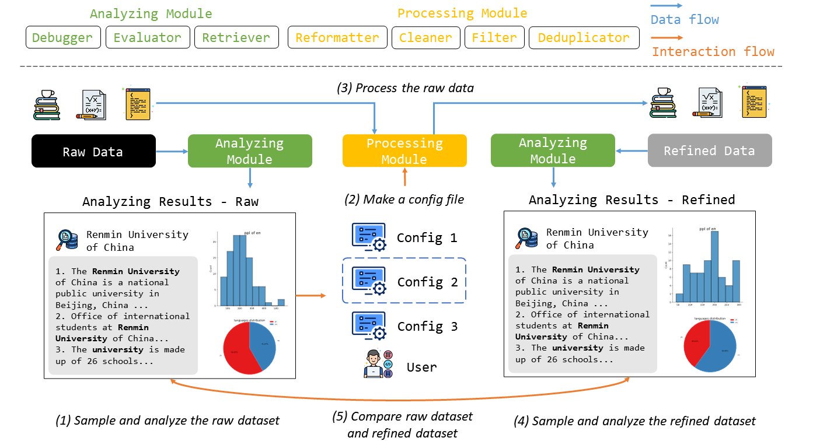
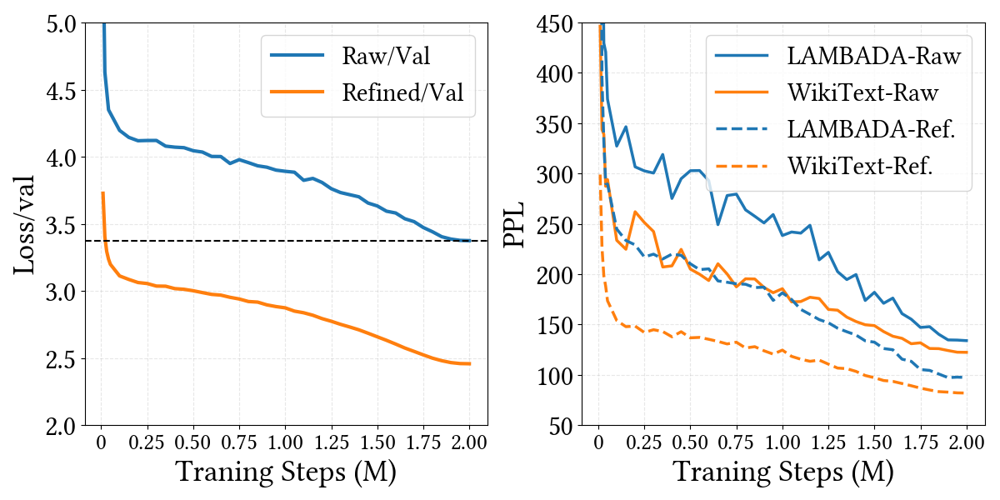

# Yulan-GARDEN: An Integrated Data Processing Framework for Pretraining Foundation Models

Authors: Yiding Sun*, Feng Wang*, Yutao Zhu, Wayne Xin Zhao, Jiaxin Mao

\[[Paper](https://arxiv.org/abs/2402.16358)\] \[[Github Repo](https://github.com/Emanual20/Yulan-GARDEN)\] \[[Demo Video](https://drive.google.com/file/d/12StUSb-6Q3ej3Qnzi74kkcJkkqxwWccu)\]

🚀 \[2024/03/26\] Our [Paper](https://arxiv.org/abs/2402.16358) has been accepted by the Demo paper track of SIGIR 2024 conference!

📖 \[2024/03/25\] Our project has been renamed to [Yulan-GARDEN](https://github.com/Emanual20/Yulan-GARDEN) from ZHEM. **Yulan-GARDEN** signifies that Yulan series LLMs (Yulan-LLM and Yulan-Chat) was brought up by Yulan-GARDEN (data produced by Yulan-GARDEN).

## Introduction 

The ability of the foundation models heavily relies on large-scale, diverse, and high-quality pretraining data. 
In order to improve data quality, researchers and practitioners often have to manually curate datasets from difference sources and develop dedicated data cleansing pipeline for each data repository.    
Lacking a unified data processing framework, this process is repetitive and cumbersome.

To mitigate this issue, we propose this data processing framework **Yulan-GARDEN** (an inte**G**rated d**A**ta p**R**ocessing framework for foun**D**ation mod**E**ls pretrai**N**ing) that integrates a **Processing Module** which consists of a series of operators at different granularity levels, and an **Analyzing Module** which supports probing and evaluation of the refined data. 
Instead of Code, we first introduce how to use this framework with some example use cases and then demonstrate its effectiveness in improving the data quality with an automated evaluation with ChatGPT and an end-to-end evaluation in pretraining the GPT-2 model.

More Details an be found in our [Paper](https://arxiv.org/abs/2402.16358).


## Quick Start

First, install the requirement packages declared by `requirements.txt`. 

Modify [settings/example.json](./settings/example.json) on your desired processing procedure. The configuration file may contains many options. For example, if you want to use regular expressions to match some dirty tokens, you should add your own regular expressions into `re_list` of `rm_re_rules`.

Copy raw data to input_path in `settings/example.json`. And make sure the output_path not exists, otherwise the output path will be overwritten.

```{commandline}
pip install -r requirements.txt
cp <raw_data> /path/to/input_path
```

Then the processing pipeline will generate an `debug_report.json` into /path/to/report_path defined in `settings/example.json`. The report displayed filter ratio of each filter rules, as well as match ratio, time cost and match cases of each regular expression cleaner rules and so on.

```{commandline}
python main.py --conf settings/example.json
```

After running the processing pipeline, the cleaned data will be merged as a `.jsonl` file, while there is just one record in a line. The record is in the form of `json`, with the field `text`, representing the refined text.

## Basic Components



Yulan-GARDEN framework consists of two main modules, the Processing Module and Analyzing Module. The Usage Details can be found README.md in corresponding directories.

### Processing Module 

Processing Module can refine the raw datasets by unifying different formats, filtering and denosing irrelevant information, and deduplicating. The Processing Module consists of four components: [Reformatter](./utils/workers/reformatter.py), [Filter](./utils/workers/filter.py), [Cleaner](./utils/workers/cleaner.py), and [Deduplicator](./utils/workers/deduplicator.py). The details of each component can be found [here](./utils/workers/README.md).

### Analyzing Module

Analyzing Module helps users facilitate a more profound comprehension of datasets through statistics analysis, specific domain knowledge retrieval, and parameter analysis of Filter and match cases of Cleaner. There are three components in the Analyzing Module, including [Evaluator](./utils/evaluator/README.md), [Retriever](./utils/retriever/README.md), and [Debugger](./utils/workers/README.md).

## Experiments

We conduct two experiments to validate the effectiveness of Yulan-GARDEN in improving the data quality. Through automated evaluation with ChatGPT, we observe a significant improvement in the quality of refined dataset when applied to OpenWebText2, Wikipedia, and HackerNews. In the end-to-end evaluation, we train two GPT-2 models using CommonCrawl before and after processing, respectively. The model trained on the refined data demonstrates remarkable performance enhancement across downstream tasks of language modeling compared to the baseline.

### Automated Evaluation

We adopt ChatGPT as an automated evaluation tool for data quality, utilizing its powerful ability of instruction following.  We evaluate which data~(i.e., before and after processing) is more suitable for training LLMs. Specifically, ChatGPT is prompted to consider various dimensions such as text formatting, fluency, coherence, and informativeness. Data pairs that are identical before and after processing, and exceed the ChatGPT's context length limitation are excluded.

The experimental results are shown in table.
On all datasets, our processed dataset significantly outperforms the raw dataset in terms of data quality.

| Datasets | \#Win | \#Lose | \#Tied |
|---------|-----|-----|-----|
|Openwebtext2|338|162|0|
|Wikipedia(en)|333|161|6|
|HackerNews|382|112|6|

### End-to-end Evaluation

To evaluate the data quality more intuitively, we trained a GPT-2 model using the raw and refined data respectively, denoted as GPT-2-raw and GPT-2-ref. We evaluated the language modeling capabilities of LLMs on other corpora in an end-to-end manner.

The evaluation results are shown as follows.
Notably, GPT-2-ref achieves the same loss as GPT-2-raw after only 0.25M steps, whereas GPT-2-raw reaches that level after 2M steps. 
Across all datasets, GPT-2-ref exhibits superior performance compared to GPT-2-raw. 
Additionally, the PPL of GPT-2-ref on the LAMBADA and WikiText103 datasets demonstrate a noticeable trend of faster decrease compared to GPT-2-raw in the initial stage.
It indicates that utilizing our proposed data processing framework enhances both the efficiency and effectiveness of training foundation models.

| Models | LAMBADA(PPL) | WikiText103(PPL) | 1BW(PPL) | CBT-CN(ACC) | CBT-NE(ACC) |
|---------|-----|-----|-----|-----|-----|
|GPT-2-raw|134.04|97.32|220.50|61.05|44.48|
|GPT-2-ref|**122.43**|**81.98**|**175.59**|**72.60**|**50.98**|



## Citations

If you find our work useful, please cite this repository or our paper: 

```
@misc{sun2024integrated,
    title={An Integrated Data Processing Framework for Pretraining Foundation Models},
    author={Yiding Sun and Feng Wang and Yutao Zhu and Wayne Xin Zhao and Jiaxin Mao},
    year={2024},
    eprint={2402.16358},
    archivePrefix={arXiv},
    primaryClass={cs.LG}
}
```