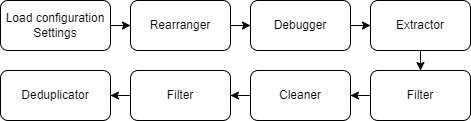

# ZHEM

## Introduction

ZHEM is a Chinese(ZH-*, like zh-cn, zh-tw and so on) Natural Language data Processing Pipeline for pretraining Large Language Models(LLMs), developed by [@Emanual20](https://github.com/Emanual20) and [@PhealenWang](https://github.com/PhealenWang) from Renmin University of China, supervised by [@defaultstr](https://github.com/defaultstr).

The target datasets of this pipeline are mainly larger than 100GB. Time cost will be prohibitively long when only single process is used. As a result, we introduced multi-processing to this pipeline.

Since the nodes for processing data, the optimized parameter of filter rules and the cleaning demands (Whether the raw data contains <html> label? Which regular expressions should be used?) may vary to a large extent among different user groups. We offer a flexible way, json files to be specific, to config the settings.

## Quick Start

First, install the requirement packages declared by `requirements.txt`. 

Modify settings/example.json on your desired processing procedure. The configuration file may contains many options. For example, if you want to use regular expressions to match some dirty tokens, you should add your own regular expressions into `re_list` of `rm_re_rules`. Also, make sure value of `use` of its father components (i.e. `rm_re_rules` and `if_clean`) are `true`. Similar modifications for other settings.

Copy raw data to input_path in settings/example.json. And make sure the output_path not exists, otherwise the output path will be covered by temporary and output files.

```{commandline}
pip install -r requirements.txt
cp <raw_data> /path/to/input_path
mkdir /path/to/output_path
python main.py --conf settings/example.json
```

Then the processing pipeline will generate an `debug_report.json` into /path/to/report_path defined in `settings/example.json`. The report displayed filter ratio of each filter rules, as well as match ratio, time cost and match cases of each regular expression cleaner rules and so on.

After running the processing pipeline, the cleaned data will be merged as a `.jsonl` file, while there is just one record in a line. The record is in the form of `json`, with two keys `text` and `source`, representing processed text and source of raw data accordingly.

## Basic Components

The basic components of ZHEM pipeline are illustrated as follows.



### Loading Configuration Settings

### Rearranger 

### Debugger

Debugger (`./utils/workers/debugger.py`) is a module to give a report (default path: `./debug_report.json`) for `Filter` hyperparameters and `Cleaner` details from a small sample from the whole data. You can set `if_debug` in `settings.json` as `true` to make it work.

In `Filter` report, Debugger lists some values of hyperparameters and corresponding filter ratio for users to choose the appropriate values of hyperparameters according to a certain filter ratio. Make sure value of `use` of the filter rules (`debug_paras` in `settings.json`) are `true`.

In `Cleaner` report, for each rule in Cleaner, Debugger includes the match ratio, which is number of successful matches divided by the total texts traversed by Debugger, the average execution time and some match cases. All of the information helps users judge whether the rule works in Cleaner. Make sure value of `use` of the cleaner rules (`clean_paras` in `settings.json`) are `true`.

### Extractor

### Filter

Filter (`./utils/workers/filter.py`) is a module to filter the useless or sensitive texts, including 4 different rules:

1. `fil_short_texts`: short texts (hyperparamter: minimum length of the texts, default: 170).

2. `fil_non_ch`: non-Chinese texts (hyperparamter: biggest ratio of non-Chinese characters , default: 0.4).

3. `fil_copyright`: 'Copyright' texts.

4. `fil_short_lines`: texts with too many short lines (hyperparamter: biggest ratio of short lines, short lines means the length of the line is less than 3, default: 0.25).

5. `fil_dirty_words`: dirty words.

6. `fil_meta`: meta information. Filter texts if its meta information is not allowed in the corresponding meta id.

7. `fil_my_rules`: other custom rules. To make ZHEM more flexible, you can set your custom rules in `./utils/utils/my_rules.py` as functions and add the names of the functions into the setting files.


All the hyperparamters are changable in the light of `Debugger`.

### Cleaner

Cleaner (`./utils/workers/cleaner.py`) is a module to clean the dirty substrings in the texts, including 6 different parts:

1. `extractor`: in [Extractor]().

2. `rm_crawlerchars`: remove the unused patterns in the text (e.g. '&nbsp').

3. `sub_newline`: remove consecutive newlines in the text.

4. `rm_re`: remove regular expressions.

5. `sub_re`: substitute regular expressions.

6. `rm_str`: remove raw strings.

7. `rm_re_lines`: remove **a line** if any text fragments in this line matching any of **regular expressions** in `re_list`.

8. `rm_str_lines`: remove **a line** if any text fragments in this line matching any of **string** in `str_list`".

9. `rm_str_seg`: remove **a segment** after matching any of **string** in `str_list` if any text fragments in this text are matched.

10. `tra2sim`: convert Traditional Chinese to Simplified Chinese.

11. `my_funcs`: other custom rules. You can set your custom rules in `./utils/utils/my_funcs.py` as functions and add the names of the functions into the setting files. 

### Deduplicator